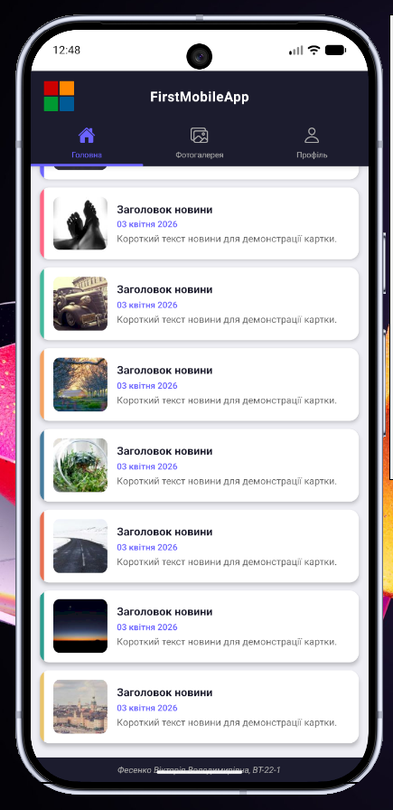
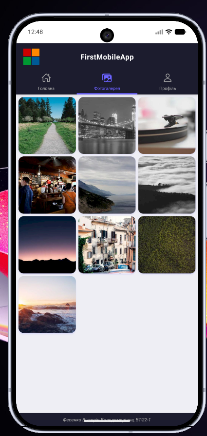
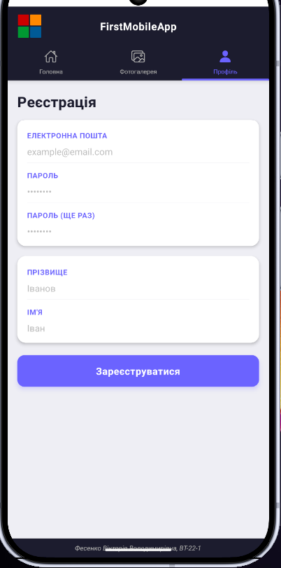

# Лабораторна робота №1 — React Native / Expo застосунок

## Опис проєкту

Цей проєкт є мобільним застосунком, створеним за допомогою **React Native** та **Expo** у межах лабораторної роботи №1.

Мета роботи — ознайомитися зі створенням та налаштуванням React Native застосунку в середовищі Expo, вивчити базову структуру проєкту, реалізувати декілька екранів застосунку та перевірити його запуск у різних середовищах.

У застосунку реалізовано основні екрани:

- **Головна** — екран зі списком новин;
- **Фотогалерея** — екран для відображення зображень у вигляді галереї;
- **Профіль / Реєстрація** — екран з формою для введення даних користувача.

Також у застосунку використовується навігація між екранами.

## Використані технології

- React Native
- Expo
- JavaScript
- React Navigation
- Android Emulator
- Web Browser

## Структура проєкту

```text
lab1/
├── App.js
├── package.json
├── assets/
├── components/
├── screens/
└── README.md
```

## Встановлення та запуск проєкту

1. Клонування репозиторію

```
git clone https://github.com/v1fes/MobileLabsRN2026.git
```

2. Перехід у папку з лабораторною роботою

```
cd MobileLabsRN2026/lab1
```

3. Встановлення залежностей

```
npm install
```

4. Запуск застосунку

```
npx expo start
```

Після запуску Expo відкриває Metro Bundler, де можна обрати спосіб запуску застосунку.

## Результат виконання




