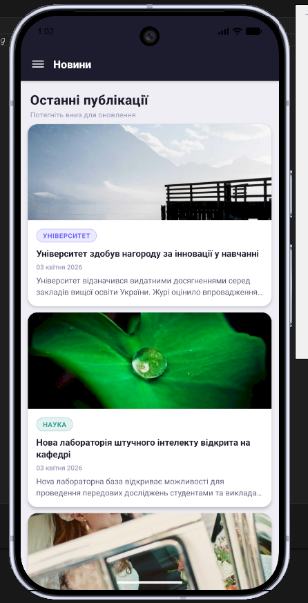
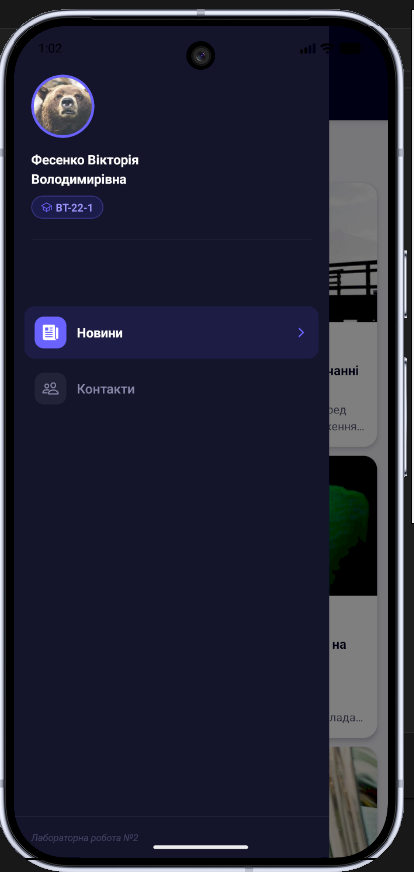
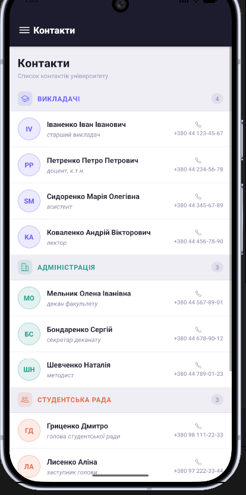

# Лабораторна робота №2 — React Native / Expo

## Тема роботи

Побудова вкладеної навігації та оптимізація відображення великих списків у React Native із використанням компонентів `FlatList` та `SectionList`.

## Опис проєкту

Цей проєкт є мобільним застосунком, створеним за допомогою **React Native** та **Expo** у межах лабораторної роботи №2.

Мета роботи — ознайомитися з принципами навігації у мобільних застосунках React Native, реалізувати вкладену навігацію за допомогою `Drawer Navigator` та `Stack Navigator`, навчитися передавати параметри між екранами, а також оптимізувати відображення великих списків за допомогою `FlatList` і `SectionList`.

У застосунку реалізовано:

- екран новин зі списком на основі `FlatList`;
- екран деталей новини з передачею параметрів;
- бокове меню `Drawer Navigator`;
- вкладену навігацію `Drawer Navigator` + `Stack Navigator`;
- екран контактів із групуванням даних через `SectionList`;
- кастомізоване Drawer-меню з аватаром, ПІБ, групою та пунктами навігації.

## Використані технології

- React Native
- Expo
- JavaScript
- React Navigation
- Drawer Navigator
- Stack Navigator
- FlatList
- SectionList
- Android Emulator
- Web Browser

## Структура проєкту

```text
lab2/
├── App.js
├── package.json
├── assets/
├── components/
├── screens/
│   ├── MainScreen.js
│   ├── DetailsScreen.js
│   └── ContactsScreen.js
└── README.md
```

## Встановлення та запуск проєкту

1. Клонування репозиторію

```
git clone https://github.com/v1fes/MobileLabsRN2026.git
```

2. Перехід у папку з лабораторною роботою

```
cd MobileLabsRN2026/lab2
```

3. Встановлення залежностей

```
npm install
```

4. Запуск застосунку

```
npx expo start
```

Після запуску Expo відкриває Metro Bundler, де можна обрати спосіб запуску застосунку.




