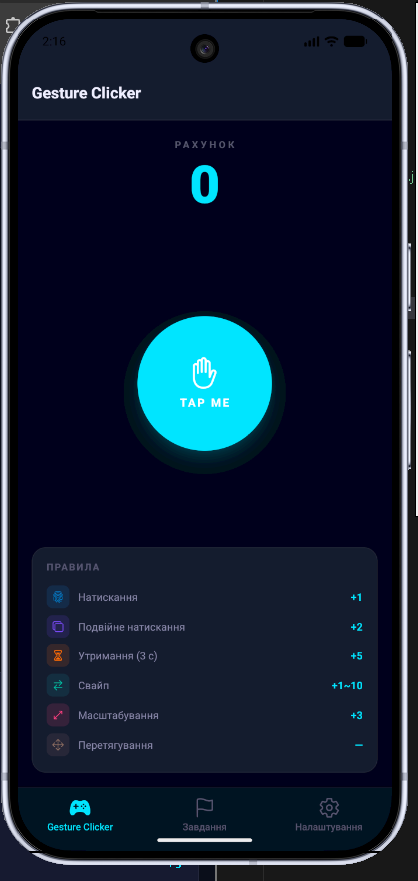
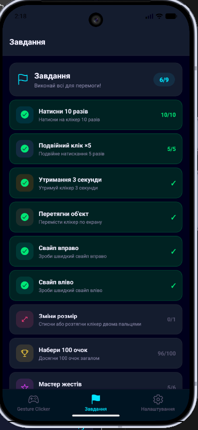
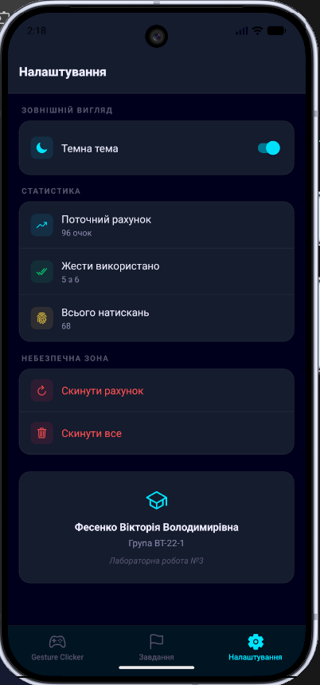
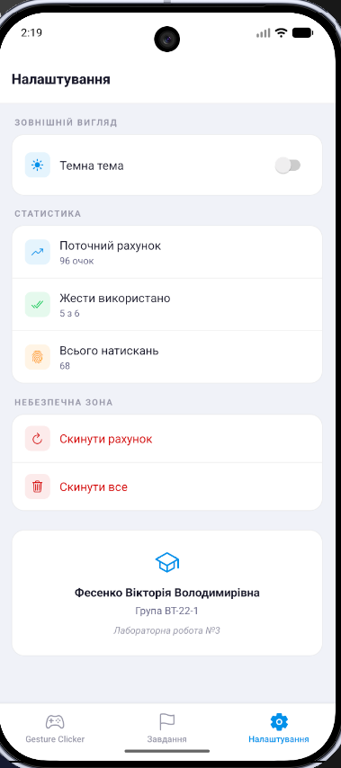

# Лабораторна робота №3 — Gesture Clicker App

## Тема роботи

Використання кастомних жестів у React Native та стилізація інтерфейсу мобільного застосунку.

## Опис проєкту

Цей проєкт є мобільним застосунком-грою, створеним за допомогою **React Native** та **Expo** у межах лабораторної роботи №3.

Основна ідея застосунку — реалізувати гру-клікер, у якій користувач отримує очки за взаємодію з об’єктом за допомогою різних жестів: натискання, подвійного натискання, довгого натискання, перетягування, свайпів та масштабування.

Мета роботи — навчитися працювати з жестами користувача у мобільному застосунку, реалізувати взаємодію через різні типи жестів та застосувати сучасні підходи стилізації інтерфейсу.

## Використані технології

- React Native
- Expo
- JavaScript
- React Navigation
- React Native Gesture Handler
- Styled Components / NativeWind
- Android Emulator
- Web Browser

## Основний функціонал

У застосунку реалізовано:

- головний екран гри-клікера;
- лічильник очок;
- інтерактивний об’єкт, який реагує на жести користувача;
- систему завдань;
- сторінку налаштувань;
- навігацію між екранами;
- підтримку світлої та темної теми;
- стилізований інтерфейс мобільного застосунку.

## Структура проєкту

```text
lab3/
├── App.js
├── package.json
├── assets/
├── components/
├── screens/
│   ├── HomeScreen.js
│   ├── ChallengesScreen.js
│   └── SettingsScreen.js
└── README.md
```

## Встановлення та запуск проєкту

1. Клонування репозиторію

```
git clone https://github.com/v1fes/MobileLabsRN2026.git
```

2. Перехід у папку з лабораторною роботою

```
cd MobileLabsRN2026/lab3
```

3. Встановлення залежностей

```
npm install
```

4. Запуск застосунку

```
npx expo start
```

## Результат виконання роботи





