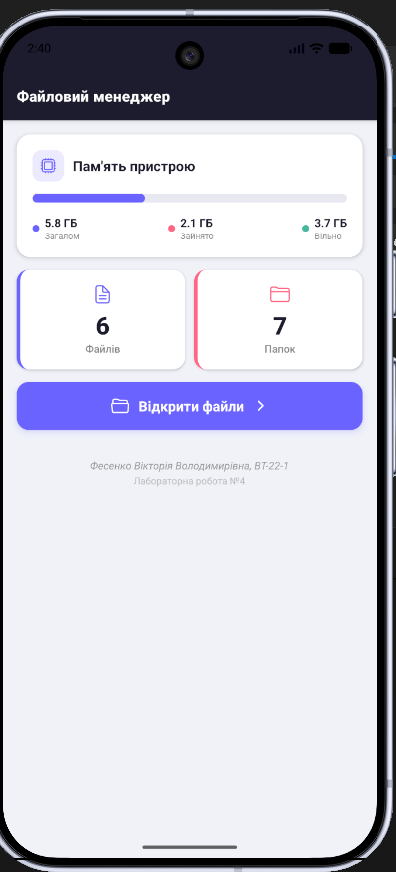
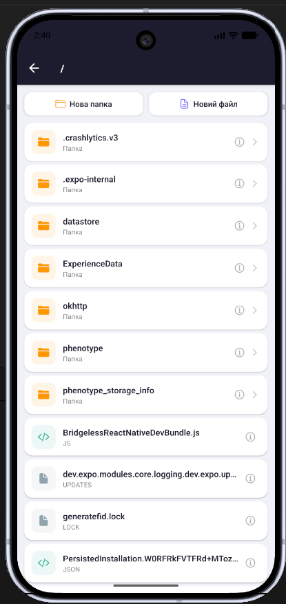
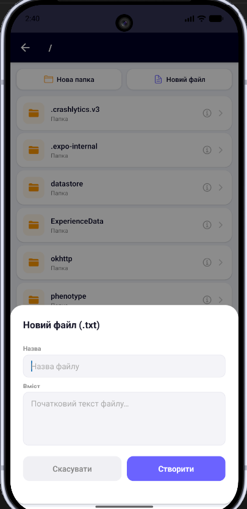
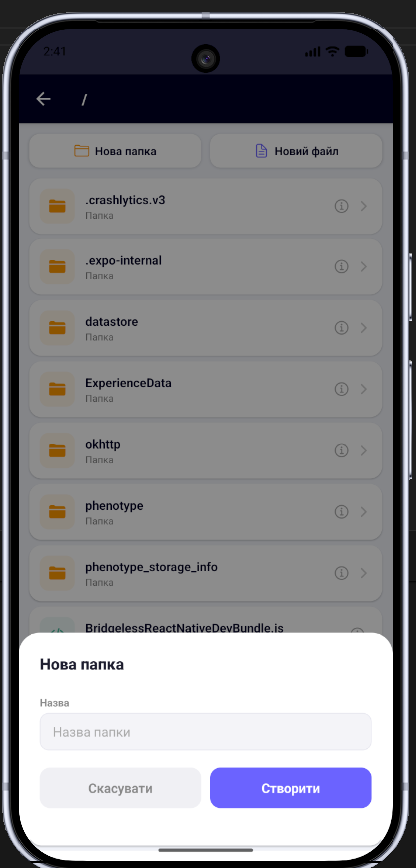
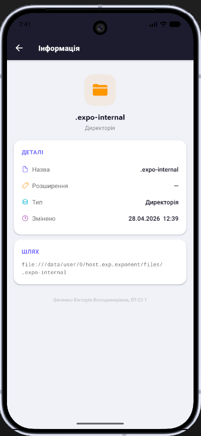

# Лабораторна робота №4 — Файловий менеджер

## Тема роботи

Робота з файловою системою в React Native з використанням бібліотеки `expo-file-system`.

## Опис проєкту

Цей проєкт є мобільним застосунком **«Файловий менеджер»**, створеним за допомогою **React Native** та **Expo**.

Мета лабораторної роботи — навчитися працювати з локальною файловою системою мобільного пристрою, використовуючи бібліотеку `expo-file-system`. У застосунку реалізовано базові операції з файлами та папками: перегляд, створення, відкриття, редагування, видалення та перегляд детальної інформації.

Застосунок дозволяє користувачу переглядати вміст локальної директорії, переходити між папками, створювати нові папки й текстові файли, відкривати `.txt` файли, редагувати їхній вміст та переглядати інформацію про об’єкти файлової системи.

## Використані технології

- React Native
- Expo
- JavaScript
- expo-file-system
- React Native components
- FlatList
- Modal
- TextInput
- Android Emulator
- Web Browser

## Основний функціонал

У застосунку реалізовано:

- навігацію по локальній файловій системі застосунку;
- відображення поточного шляху;
- перегляд списку файлів і папок;
- перехід у вкладені папки;
- повернення до попередньої директорії;
- створення нових папок;
- створення текстових файлів `.txt`;
- відкриття текстових файлів для перегляду;
- редагування вмісту текстових файлів;
- збереження змін у файл;
- видалення файлів і папок;
- підтвердження перед видаленням;
- перегляд детальної інформації про файл або папку;
- відображення статистики пам’яті пристрою.

## Структура проєкту

```text
LAB4/
├── .expo/
├── assets/
├── node_modules/
├── screens/
├── .gitignore
├── App.js
├── app.json
├── image.png
├── image-1.png
├── image-2.png
├── image-3.png
├── image-4.png
├── index.js
├── package-lock.json
├── package.json
└── README.md
```

## Встановлення та запуск проєкту

1. Клонування репозиторію

```

git clone https://github.com/v1fes/MobileLabsRN2026.git

```

2. Перехід у папку з лабораторною роботою

```

cd MobileLabsRN2026/lab2

```

3. Встановлення залежностей

```

npm install

```

4. Запуск застосунку

```

npx expo start

```

Після запуску Expo відкриває Metro Bundler, де можна обрати спосіб запуску застосунку.

## Результат виконання роботи







```

```
