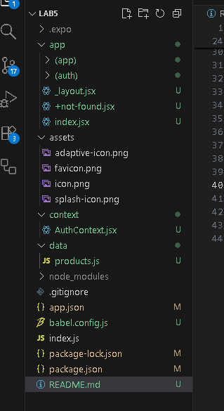
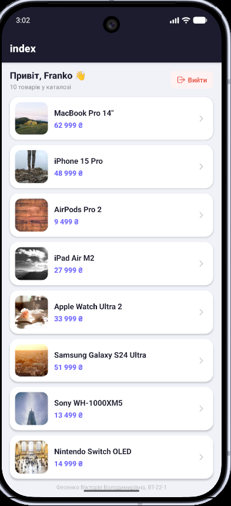

# Лабораторна робота №5 — Expo Router Navigation

## Тема роботи

Побудова навігації у React Native із використанням бібліотеки **Expo Router**.

## Опис проєкту

Цей проєкт є мобільним застосунком, створеним за допомогою **React Native**, **Expo** та **Expo Router**.

Мета лабораторної роботи — ознайомитися з концепцією **file-based маршрутизації** у мобільних застосунках. У проєкті реалізовано навігацію на основі файлової структури папки `app`, публічні та захищені маршрути, авторизацію через глобальний контекст, каталог товарів і сторінку деталей товару з динамічним маршрутом.

У застосунку реалізовано:

- публічні екрани входу та реєстрації;
- глобальний контекст авторизації;
- захищені маршрути для авторизованих користувачів;
- каталог товарів;
- перехід на сторінку деталей товару;
- динамічні маршрути через `[id].jsx`;
- обробку неіснуючих маршрутів через `+not-found.jsx`;
- вихід з акаунту.

## Використані технології

- React Native
- Expo
- Expo Router
- JavaScript / JSX
- React Context
- FlatList
- Link
- Redirect
- useLocalSearchParams
- Android Emulator
- Web Browser

## Структура проєкту



## Встановлення та запуск проєкту

1. Клонування репозиторію

```
git clone https://github.com/v1fes/MobileLabsRN2026.git
```

2. Перехід у папку з лабораторною роботою

```
cd MobileLabsRN2026/lab5
```

3. Встановлення залежностей

```
npm install
```

4. Запуск застосунку

```
npx expo start
```

Після запуску Expo відкриває Metro Bundler, де можна обрати спосіб запуску застосунку.

## Результат виокнання роботи





