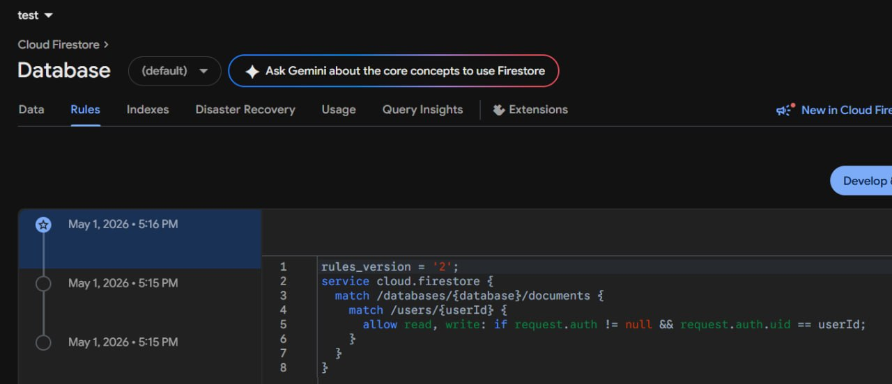

# Лабораторна робота №6

## Тема

Побудова авторизації та збереження персональних даних у React Native з використанням Firebase Authentication та Firestore

## Інструкція запуску

1. Склонуйте репозиторій.
2. Встановіть залежності: `npm install`
3. Створіть проект Firebase в консолі Firebase.
4. Додайте веб-застосунок у Firebase та скопіюйте конфігурацію в файл `firebaseConfig.ts`.
5. Увімкніть Email/Password Authentication у Firebase.
6. Створіть базу даних Firestore та налаштуйте Security Rules:

```rules
rules_version = '2';
service cloud.firestore {
  match /databases/{database}/documents {
    match /users/{userId} {
      allow read, write: if request.auth != null && request.auth.uid == userId;
    }
  }
}
```

7. Запустіть додаток: `npx expo start`

## Опис реалізованого функціоналу

- **Авторизація:** реалізовано реєстрацію, вхід та вихід користувача.
- **Відновлення пароля:** здійснюється через Firebase API (лист на пошту).
- **Збереження даних:** сторінка профілю дозволяє користувачу зберігати, оновлювати своє ім'я, вік та місто. Дані зберігаються у Firestore у колекції `users` (документ `uid`).
- **Захист доступу:** Firestore Security Rules налаштовані так, що лише власник може читати/редагувати свої дані. Expo Router використовується для захисту доступу на клієнті на основі контексту `AuthContext`.
- **Видалення і редагування акаунту:** реалізовано можливість повторної автентифікації для видалення акаунту та відповідного документа в базі даних.

## Висновки

Під час виконання лабораторної роботи було успішно налаштовано авторизацію з використанням Firebase Auth. Інтегровано Firestore для збереження персональних даних, налаштовано правила доступу, і реалізовано захищену навігацію через Expo Router (групи `(auth)` і `(app)`).




